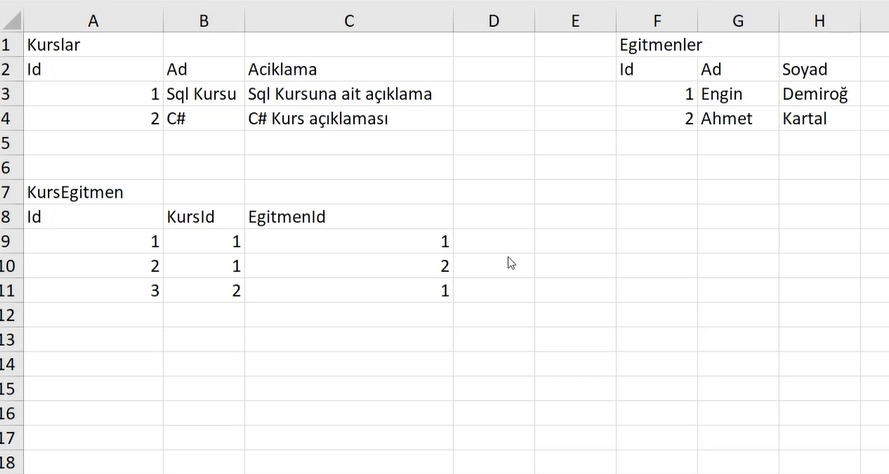
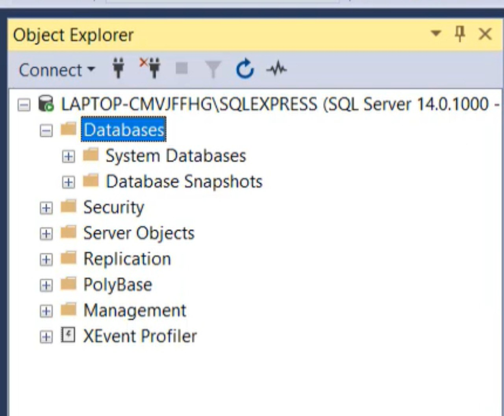
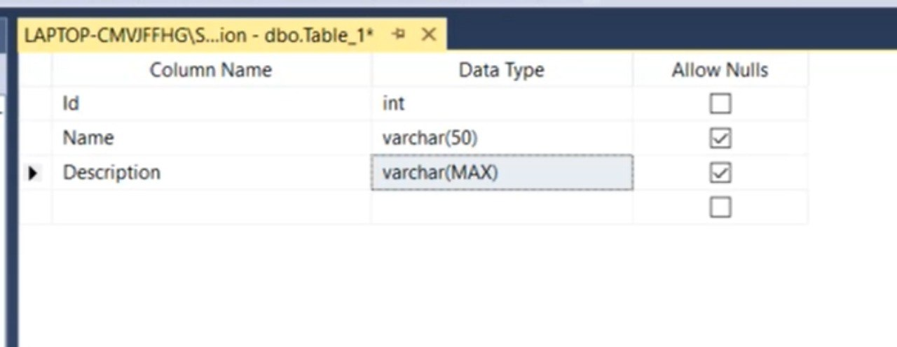

# Tasarımın Gerçek Veri Tabanına Aktarılması

# Contents
* [RDBMS Kurulumu](#rdbms-kurulumu)
* [Kurslar Tablosunun Oluşturulması](#kurslar-tablosu)
* [Primary Key Kullanımı](#primary-key)
* [Tabloların Tamamlanması](#tabloların-tamamlanmasi)
* [İlişkilerin Fiziksel Olarak Oluşturulması](#fiziksel-ilişkiler)
* [Otomatik Artan alanlar](#otomatik-artan-alanlar)

- ## RDBMS Kurulumu 
Veri tabanı yönetimi, tablo oluşturma, sql sorguları çalıştırma, otomasyon projelerini yönetebilme ve her türlü sql veri tabanı operasyonlarını gerçekleştirebilmek için bir veri tabanı yönetim sistemine ihtiyacımız var. Bu durumda Microsoft Sql Server, MySQl, PostgreSQL, Oracle gibi sistemler olabilir. Kullanmak istediğimi veri tabanı yönetim sistemini internet üzerinden indirip sql işlemlerimize devam edebiliriz.

- ## Kurslar Tablosunun Oluşturulması  

Biz excel uygulamasını kullanarak aşağıdaki gibi 3 tablo oluşturmuştuk.

Şimdi bu tabloyu Microsoft SQL Server veri tabanı yönetim sistemini kullanarak oluşturalım. 

Sql Server'a giriş yaptıktan sonra sol tarafta bulunan object explorer ile database ekleme / tablo ekleme / tablo düzenleme, görüntüleme gibi işlemleri yapabiliriz.

Add new database(Education isimli) dedikten sonra yukarıdaki gibi Courses, Instructors, CourseInstructors tablolarını oluşturalım. Tablolarda Id sütunu, her bir kaydın farklı(unique) olmasını sağlayan alandır. 

Education isimli veri tabanında kurslar tablosunu oluşturalım.

Allow Null alanı o sütuna karşılık gelen değerin boş olmasına izin ver anlamına gelir. Data type alanı ise tutulan değerin ne tür bir veri olduğunu söyler. Bütün veri tipleri ve kapladıkları alan hakkında bilgi sahibi olmak için sql data types şeklinde google'da arama yapabiliriz.

- ## Primary Key Kullanımı  
Tablomuzda Id üzerinde sağ tıklayıp "Set As Primary Key" dersek Id herkes için farklı olmak zorunda olur. Böylelikle her kayıt  birbirinden farklı olur. Ve de bir tabloda sadece ve sadece bir tane Primary key olabilir. 
