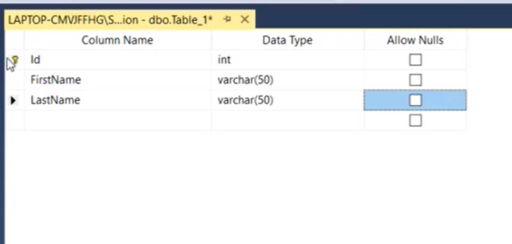
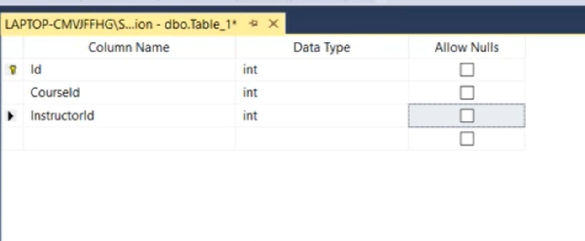
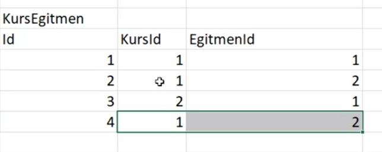
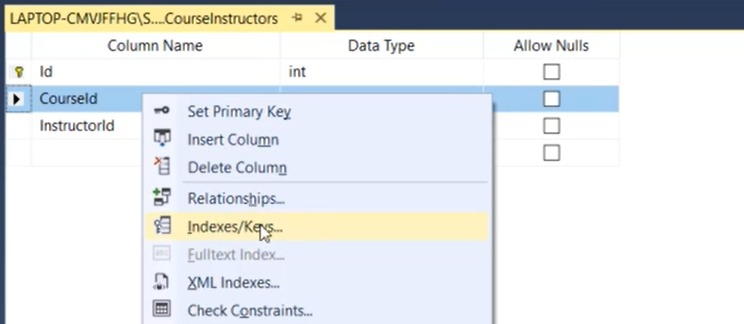
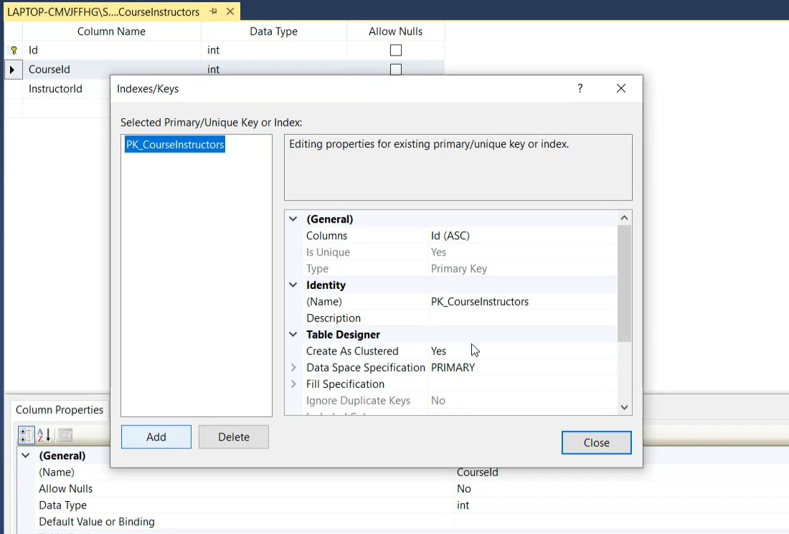
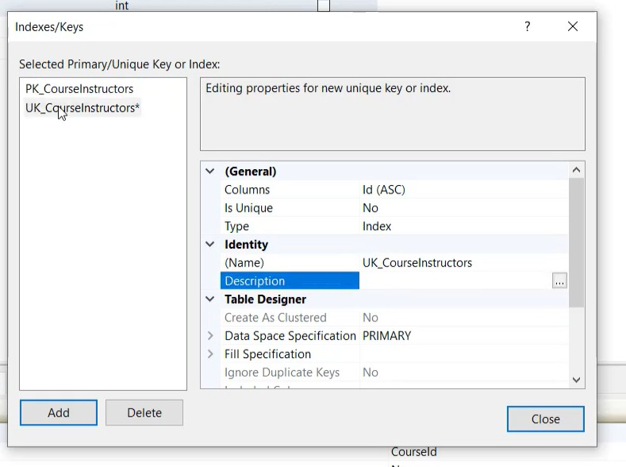
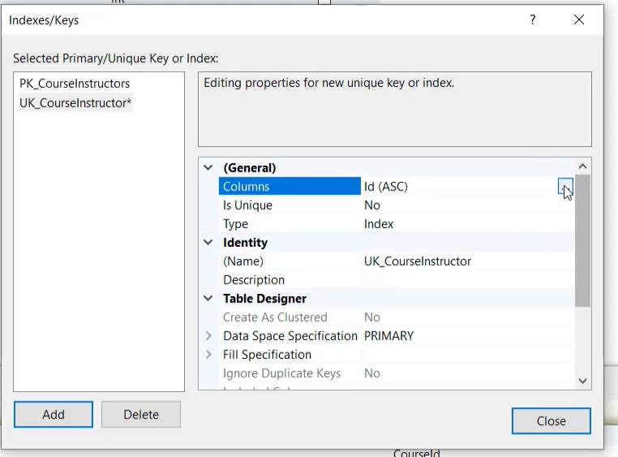
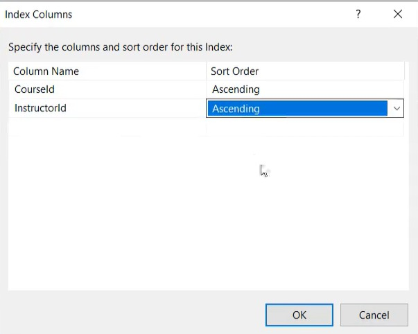
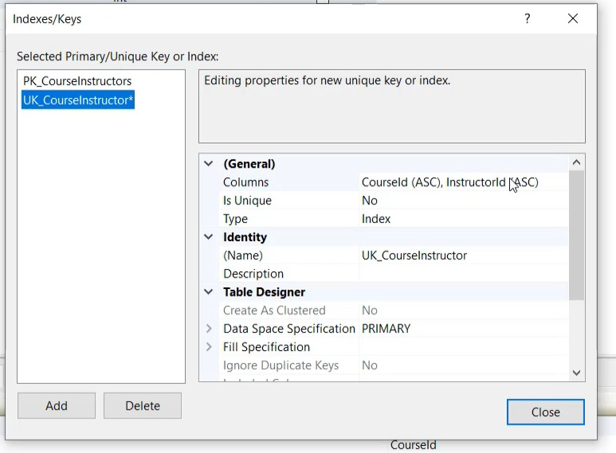
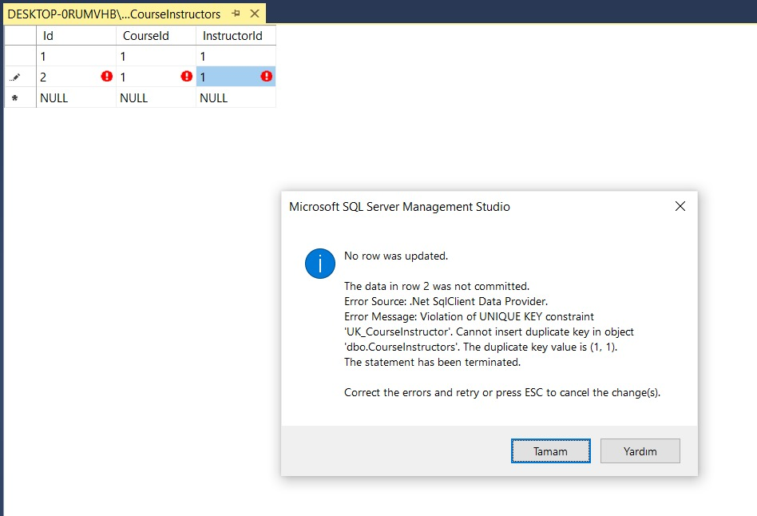

# Demo Tasarımın Gerçek Veri Tabanına Aktarılması

# Contents
* [RDBMS Kurulumu](#rdbms-kurulumu)
* [Kurslar Tablosunun Oluşturulması](#kurslar-tablosu)
* [Primary Key Kullanımı](#primary-key)
* [Tabloların Tamamlanması](#tablolarin-tamamlanmasi)
* [Unique Key İle Çalışmak](#unique-key)
* [İlişkilerin Fiziksel Olarak Oluşturulması](#fiziksel-ilişkiler)
* [Otomatik Artan alanlar](#otomatik-artan-alanlar)

- ## RDBMS Kurulumu 
Veri tabanı yönetimi, tablo oluşturma, sql sorguları çalıştırma, otomasyon projelerini yönetebilme ve her türlü sql veri tabanı operasyonlarını gerçekleştirebilmek için bir veri tabanı yönetim sistemine ihtiyacımız var. Bu durumda Microsoft Sql Server, MySQl, PostgreSQL, Oracle gibi sistemler olabilir. Kullanmak istediğimi veri tabanı yönetim sistemini internet üzerinden indirip sql işlemlerimize devam edebiliriz.

- ## Kurslar Tablosunun Oluşturulması  

Biz excel uygulamasını kullanarak aşağıdaki gibi 3 tablo oluşturmuştuk.

Şimdi bu tabloyu Microsoft SQL Server veri tabanı yönetim sistemini kullanarak oluşturalım. 

Sql Server'a giriş yaptıktan sonra sol tarafta bulunan object explorer ile database ekleme / tablo ekleme / tablo düzenleme, görüntüleme gibi işlemleri yapabiliriz.

Add new database(Education isimli) dedikten sonra yukarıdaki gibi Courses, Instructors, CourseInstructors tablolarını oluşturalım. Tablolarda Id sütunu, her bir kaydın farklı(unique) olmasını sağlayan alandır. 

Education isimli veri tabanında kurslar tablosunu oluşturalım.

Allow Null alanı o sütuna karşılık gelen değerin boş olmasına izin ver anlamına gelir. Data type alanı ise tutulan değerin ne tür bir veri olduğunu söyler. Bütün veri tipleri ve kapladıkları alan hakkında bilgi sahibi olmak için sql data types şeklinde google'da arama yapabiliriz.

- ## Primary Key Kullanımı  
Tablomuzda Id üzerinde sağ tıklayıp "Set As Primary Key" dersek Id herkes için farklı olmak zorunda olur. Böylelikle her kayıt  birbirinden farklı olur. Ve de bir tabloda sadece ve sadece bir tane Primary key olabilir. 

- ## Tabloların Tamamlanması  

RDBMS: Sql Server
Database: Education
Tables: Courses, Instructors, CourseInstructors

Education isimli veri tabanında Courses tablosu.

Education isimli veri tabanında Instructors tablosu.

Education isimli veri tabanında CourseInstructors tablosu.

- ## Unique Key İle Çalışmak 

Primaery Key'i ve de onun anahtar türlerinden bir tanesi olduğunu öğrendik. Bir de veri tabanı yapısını kurduktan sonra unique key isimli bir anahtar söz konusu. Unique key tam olarak şu; 

Aşağıdaki tabload Id'si 2 ve 4 olan kayıtlara dikkat edelim. iki kayıtta birbirinin aynısı. Yani burada yanlış girilmiş bir veri var. Burada KursId ve EgitmenId kolonları Unique Key'dir. Yani o kolonlar için aynı değere sahip 2 kayıt olamaz.

Peki bunu bir veri tabanı ortamında uygulamak istersek nasıl yaparız? İstediğimiz tabloyu seçip design diyoruz. Bu noktada tabloda herhangi bir column name değeri üzerinde sağ tıklayıp indexes-keys seçeneğine tıklarız. Bu farklı veri tabanı yönetim sistemlerinde farklı menülerde olabilir. 

İndexes/Keys seçeneğine tıkladıktan sonra açılan ekran bize index'leri ve anahtarları gösterir. 

Bizim zaten bir tane primary key'imiz varmış. Add diyerek yeni bir tane ekleyebiliriz. 

 

Burada yeni eklenen key'in ismini biz sağ tarafta bulunan poperties kısmından değiştirebiliriz. UK_CourseInstructor yapalım, Unique anahtar yapacaksak eğer. 

Daha sonra hangi kolonların Unique Key olacağını belirleriz. Bunun için properties'de columns'u seçeriz.

 

CourseId ve InstructorId kolonlarını Unique Key olarak seçelim.

 

Daha sonra o kolonların Unique Key olarak seçildiğini görürüz. Ve ayrıca Type'ın karşısını Unique Key olarak belirtelim.

 

Biz şu anda CourseInstructors tablosu için CourseId ve InstructorId alanlarını Unique Key olarak belirledik. Böylece bu iki alan için aynı kayıt girilemeyecek. Girilmeye çalışırsa aşağıdaki gibi hata gösterilir!

 

Kısacası Unique Key; bizim belirttiğimiz kolonun ya da kolonlar topluluğunun eşsiz olmasını sağlar. 

NOT: Unique Key tek nir kolon da olabilir, birden fazla kolonun kümülatif(bir araya gelmiş hali) de olabilir.
