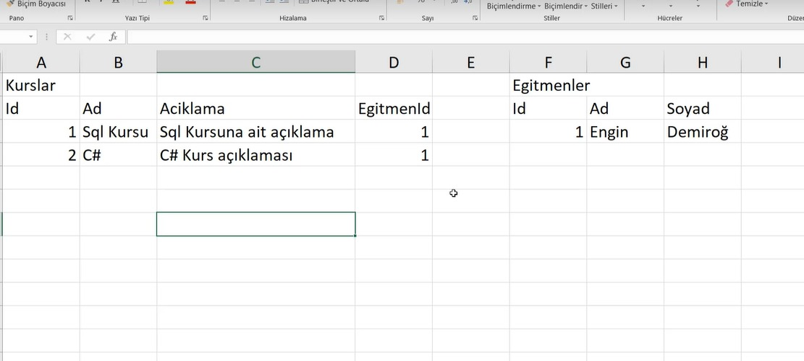
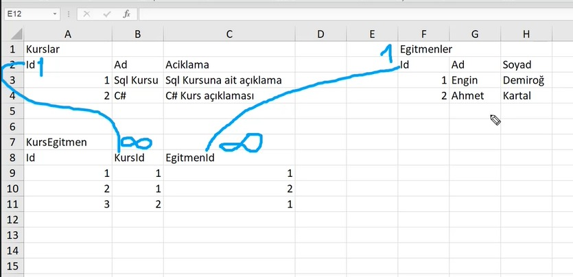

- # Workshop 1  / Normalisation Odaklı Tasarım

# Contents
* [Tablo Tasarımı](#tablo-tasarimi)
* [Senaryo](#senaryo)

- ## Tablo Tasarımı 

Bu derste temel bir tablo tasarımı yapalım. Örneğin Udemy gibi bir platform için aşağıdaki bilgileri tutacağımız bir tablo oluşturalım. 

Proje: Udemy gibi bir sistemin veritabanını kurmak istiyoruz. 

Gereksinimler: 
- Sistemimizdeki Kurs bilgilerini tutalım.
- Sistemimizdeki Eğitmen bilgilerini tutalım. 
- Bir kursun sadece bir eğitmeni olabilir. (Kurs ile eğitmeni ilişkilendirmek için)

Tablolarda bir kaydı diğer kayıttan ayıran ID'lere ihtiyaç duyarız.

### Kurs ve Eğitmen Tabloları Arasındaki İlişkilendirme

- #### Bir kursun sadece bir eğitmeni olabilir. Ancak bir eğitmenin birden fazla kursu olabilir.

- ## Veri Tabanı Sistemi İçin Senaryonun Tanıtılması 

Proje: Udemy gibi bir sistemin veritabanını kurmak istiyoruz

Gereksinimler:
- Kurs bilgilerini tutmak istiyoruz.
- Eğitmen bilgilerini tutmak istiyoruz. 
- Bir kursun bir veya birden fazla eğitmeni olabilir. Yani bir kursu bir eğitmen de hazırlayabilir, beş eğitmen de 
hazırlayablir. 

- ##### Bir kursun sadece bir eğitmeni olabilir. Ancak bir eğitmenin birden fazla kursu olabilir.

- ##### Bu durumda bizim bir geçiş(referans) tablosuna ihtiyaç duyarız. Yani KursEgitmen isminde yeni bir tablo oluşturup hangi kursun hangi eğitmenler tarafından hazırlandığı bilgisini tutabiliriz. 

- Kurs ve KursEgitmen tabloları arasındaki ilişkiyi kuralım. Kurs tablosunda her kurs yalnızca bir kere belirtilir fakat KursEgitmen tablosunda bir kurs birden fazla kere tekrar edebilir. Bu durumda Kurs tablosundaki Id kolonu ile KursEgitmen tablosundaki KursId kolonu 1 ve sonsuz olacak şekilde fiziksel olarak ilişkilendirilir. 

 

- Aynı şekilde Egitmen tablosundaki Id ile KursEgitmen tablosundaki EgitmenId ilişkilendirilir.