# Demo Tasarımın Gerçek Veri Tabanına Aktarılması

# Contents
* [RDBMS Kurulumu](#rdbms-kurulumu)
* [Kurslar Tablosunun Oluşturulması](#kurslar-tablosu)
* [Primary Key Kullanımı](#primary-key)
* [Tabloların Tamamlanması](#tablolarin-tamamlanmasi)
* [Unique Key İle Çalışmak](#unique-key)
* [İlişkilerin Fiziksel Olarak Oluşturulması](#fiziksel-iliskiler)
* [Otomatik Artan alanlar](#otomatik-artan-alanlar)

- ## RDBMS Kurulumu 
Veri tabanı yönetimi, tablo oluşturma, sql sorguları çalıştırma, otomasyon projelerini yönetebilme ve her türlü sql veri tabanı operasyonlarını gerçekleştirebilmek için bir veri tabanı yönetim sistemine ihtiyacımız var. Bu durumda Microsoft Sql Server, MySQl, PostgreSQL, Oracle gibi sistemler olabilir. Kullanmak istediğimi veri tabanı yönetim sistemini internet üzerinden indirip sql işlemlerimize devam edebiliriz.

- ## Kurslar Tablosunun Oluşturulması  

Biz excel uygulamasını kullanarak aşağıdaki gibi 3 tablo oluşturmuştuk.

Şimdi bu tabloyu Microsoft SQL Server veri tabanı yönetim sistemini kullanarak oluşturalım. 

Sql Server'a giriş yaptıktan sonra sol tarafta bulunan object explorer ile database ekleme / tablo ekleme / tablo düzenleme, görüntüleme gibi işlemleri yapabiliriz.

Add new database(Education isimli) dedikten sonra yukarıdaki gibi Courses, Instructors, CourseInstructors tablolarını oluşturalım. Tablolarda Id sütunu, her bir kaydın farklı(unique) olmasını sağlayan alandır. 

Education isimli veri tabanında kurslar tablosunu oluşturalım.

Allow Null alanı o sütuna karşılık gelen değerin boş olmasına izin ver anlamına gelir. Data type alanı ise tutulan değerin ne tür bir veri olduğunu söyler. Bütün veri tipleri ve kapladıkları alan hakkında bilgi sahibi olmak için sql data types şeklinde google'da arama yapabiliriz.

- ## Primary Key Kullanımı  
Tablomuzda Id üzerinde sağ tıklayıp "Set As Primary Key" dersek Id herkes için farklı olmak zorunda olur. Böylelikle her kayıt  birbirinden farklı olur. Ve de bir tabloda sadece ve sadece bir tane Primary key olabilir. 

- ## Tabloların Tamamlanması  

RDBMS: Sql Server
Database: Education
Tables: Courses, Instructors, CourseInstructors

Education isimli veri tabanında Courses tablosu.

Education isimli veri tabanında Instructors tablosu.
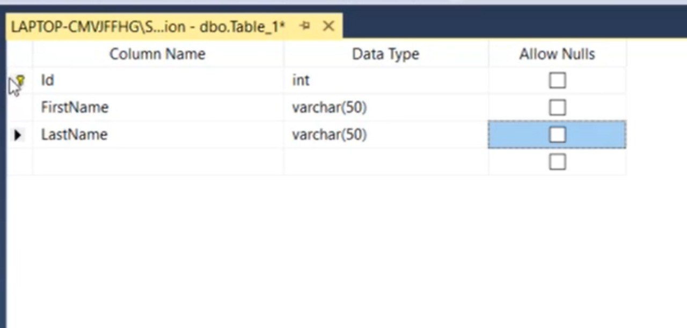

Education isimli veri tabanında CourseInstructors tablosu.
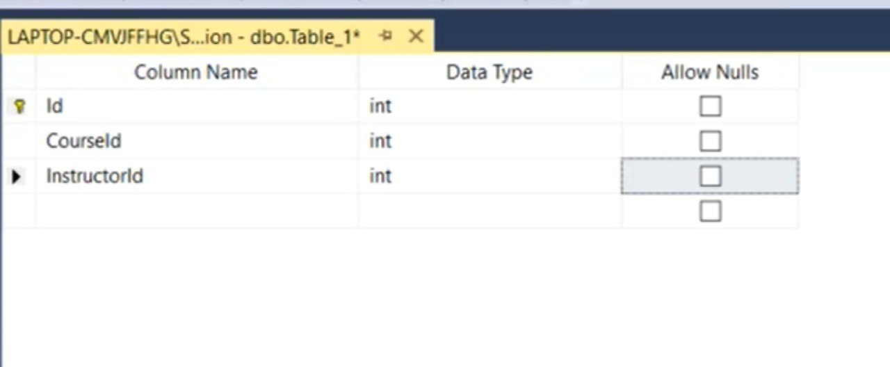

- ## Unique Key İle Çalışmak 

Primaery Key'i ve de onun anahtar türlerinden bir tanesi olduğunu öğrendik. Bir de veri tabanı yapısını kurduktan sonra unique key isimli bir anahtar söz konusu. Unique key tam olarak şu; 

Aşağıdaki tabload Id'si 2 ve 4 olan kayıtlara dikkat edelim. iki kayıtta birbirinin aynısı. Yani burada yanlış girilmiş bir veri var. Burada KursId ve EgitmenId kolonları Unique Key'dir. Yani o kolonlar için aynı değere sahip 2 kayıt olamaz.

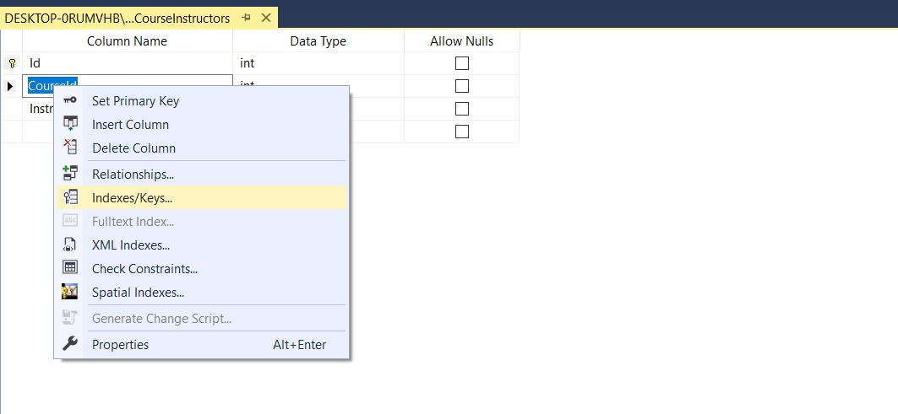

Peki bunu bir veri tabanı ortamında uygulamak istersek nasıl yaparız? İstediğimiz tabloyu seçip design diyoruz. Bu noktada tabloda herhangi bir column name değeri üzerinde sağ tıklayıp indexes-keys seçeneğine tıklarız. Bu farklı veri tabanı yönetim sistemlerinde farklı menülerde olabilir. 

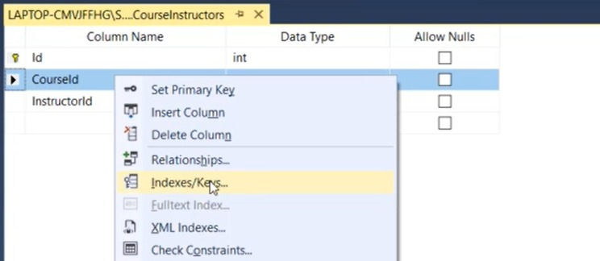

İndexes/Keys seçeneğine tıkladıktan sonra açılan ekran bize index'leri ve anahtarları gösterir. 

Bizim zaten bir tane primary key'imiz varmış. Add diyerek yeni bir tane ekleyebiliriz. 

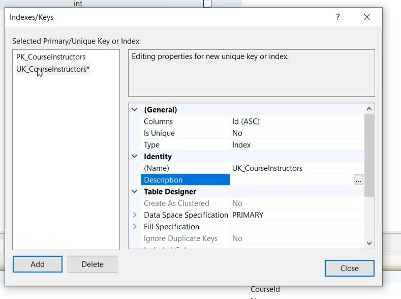 

Burada yeni eklenen key'in ismini biz sağ tarafta bulunan poperties kısmından değiştirebiliriz. UK_CourseInstructor yapalım, Unique anahtar yapacaksak eğer. 

Daha sonra hangi kolonların Unique Key olacağını belirleriz. Bunun için properties'de columns'u seçeriz.

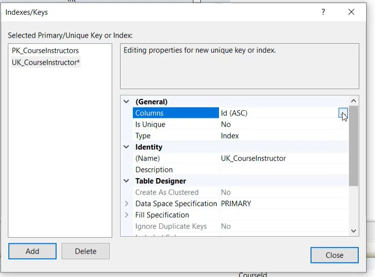 

CourseId ve InstructorId kolonlarını Unique Key olarak seçelim.

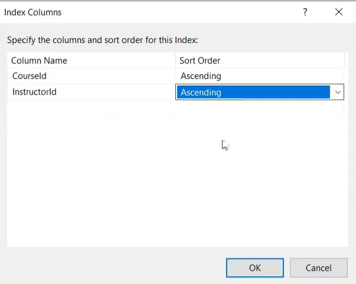 

Daha sonra o kolonların Unique Key olarak seçildiğini görürüz. Ve ayrıca Type'ın karşısını Unique Key olarak belirtelim.

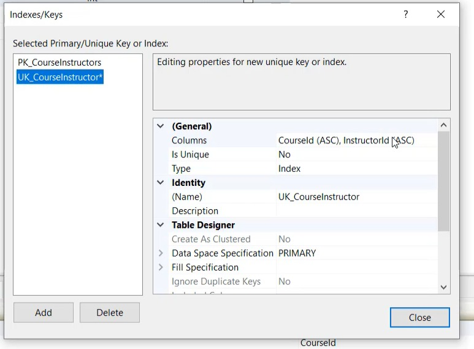 

Biz şu anda CourseInstructors tablosu için CourseId ve InstructorId alanlarını Unique Key olarak belirledik. Böylece bu iki alan için aynı kayıt girilemeyecek. Girilmeye çalışırsa aşağıdaki gibi hata gösterilir!

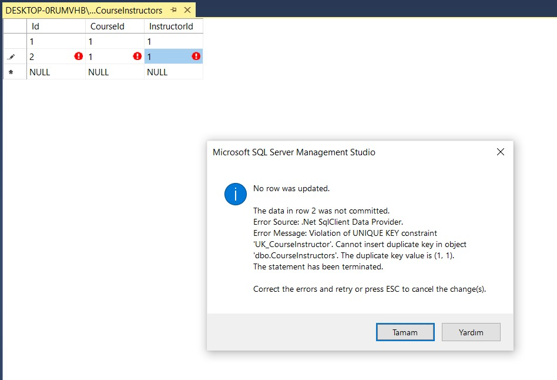 

Kısacası Unique Key; bizim belirttiğimiz kolonun ya da kolonlar topluluğunun eşsiz olmasını sağlar. 

NOT: Unique Key tek nir kolon da olabilir, birden fazla kolonun kümülatif(bir araya gelmiş hali) de olabilir.

- ## İlişkilerin Fiziksel Olarak Oluşturulması 
Sql Server'da Object Explorer'da Database Diagrams'a tıklaınca bize veri tabanımızdaki tabloların diagramlarını oluşturabileceğimiz alan açılır. 

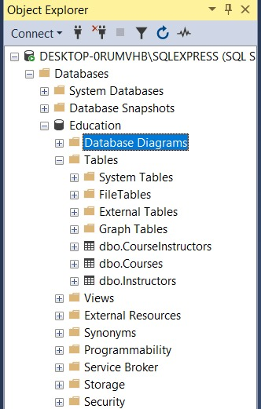 

 
Yani bu şekilde biz database içerisindeki seçtiğimiz tabloları diagram şeklinde görüntüleyrbiliriz. 

 
Biz burada Courses ile CoursesInstructors arasında ilişki olduğunu biliyoruz. İlişkisel veri tabanlarında biz ilişkileri fiziksel olarak belirleriz ki yanlış data'lar sisteme dahil olmasın. Bu bağlamda iki tablo arasındaki ilişkiyi belirtme sürecine gireriz. Courses tablosundaki id üzerinde basıl tutup sürükleyerek CoursesInstructors tabosundaki CourseId sütununun üzerine bırakıyoruz. 

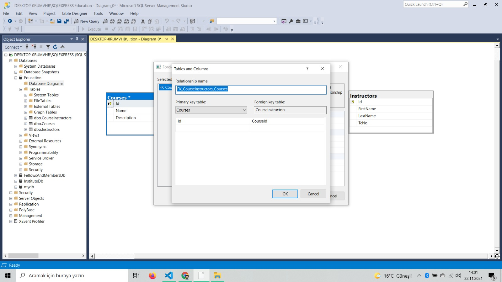 
Daha sonra alanları kontrol ederiz ve Okey deriz. İşte şu an bizim için çok önemli bir anahtar daha çıktı, o da foreign key. Foreign Key yani ikincil anahtar(yabancı anahtar) bizim ilk tabloda olan bir alanın farklı tablodaki karşılık gelen Id'sine denir. Burada Courses tablosundaki Id alanına CoursesInstructors tablosundaki CourseId alanı karşılık geliyor. Yani CoursesId alanı bu durumda foreign key oluyor. 

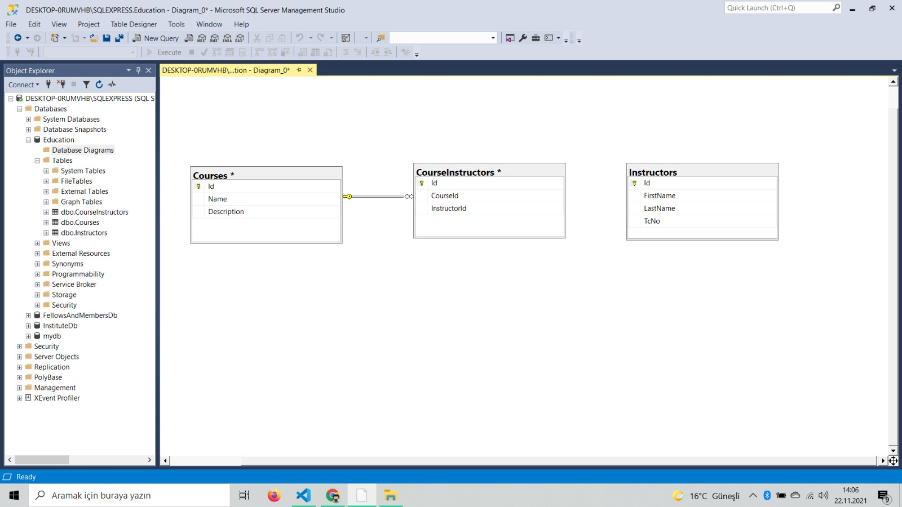 
Burada dikkat edersek ilk tablodaki anahtar işareti ikinc tabloda yüzde işaretine karşılık geliyor. Anahtar bir demek zaten, yani bire çok bir ilişki söz konusu. 

Aynı şekilde Instructors tablosundaki Id alanı ile CoursesInstructors alanındaki InstructorsId alanı arasındaki ilişkiyi oluşturalım. 

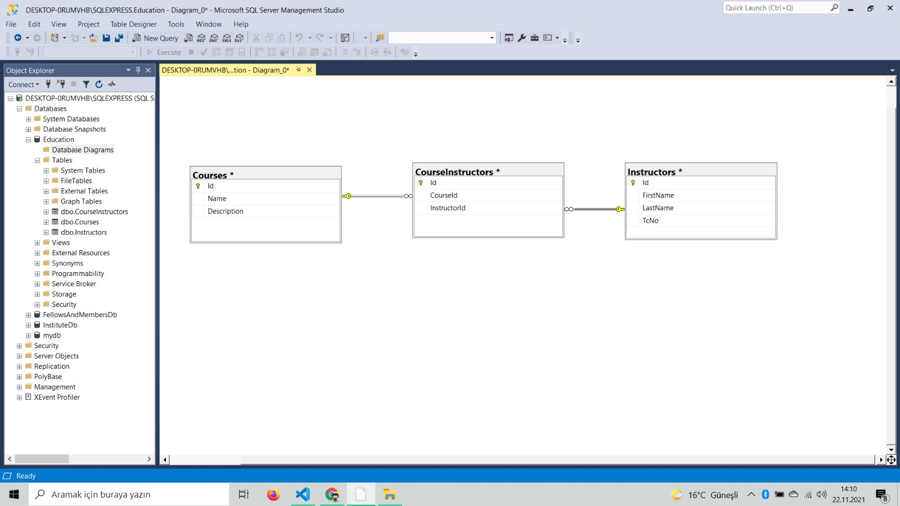 

Daha sonra oluşan diagramımızı CourseInstructor ismi ile kaydedelim. Artık object explorer'dan istediğimiz zaman diagramı açıp görüntüleyebiliriz. 

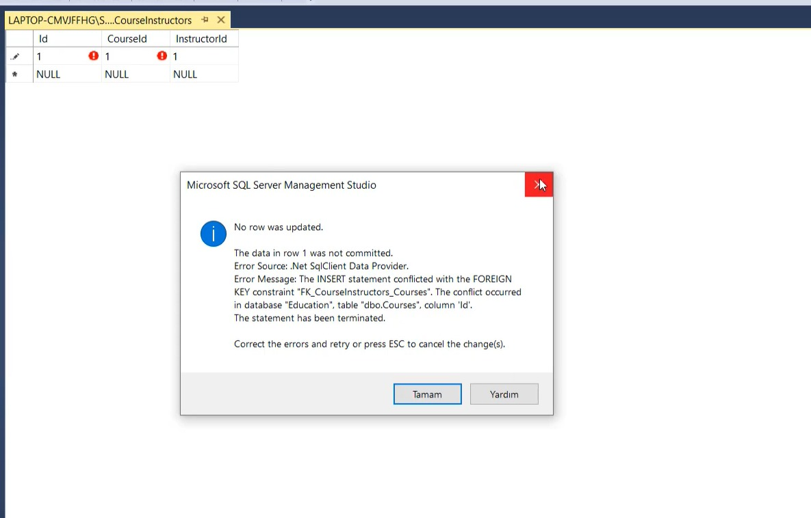 

Biz eğer ki Courses ve Instructors tablosuna kayıt eklemeden ilk olarak CoursesInstructors tablosuna kayıt eklemek istersek Foreign Key hatası alırız, bu bize şunu der, CourseId alanında 1'e karşılık gelen kayıt henüz Courses tablosunda yok ve InstructorsId alanındaki 1'e karşılık gelen değer de henüz Instructors tablosunda yok. Bu sebeple Foreign Key hatası alırız. 

İşte bu tam olarak ilişkisel bir veri tabanının çalışma mantığıdır. 

Ayrıca eğer biz 3 tabloya da kayıt ekledikten sonra Courses tablosuna gelip kaydı silmek istersek yine hata alırız, çünkü o kaydın ilişkili tabloda karşılığı vardır ve bizim silmemize izin vermez. Onu silebilmek için ilk önce ilişkili tablodaki kaydı(foreign key) silmek gerekir. 

- ## Otomatik Artan Alanlarla Çalışmak 

Tablolarımızda bulunan Id sütunlarında biz değerleri şimdiye kadar elimizle manuel bir şekilde arttırıyorduk(Kendimiz değer veriyorduk). Fakat otomatik artan Id değerleri (auto increment id) ile çalışmak daha sağlıklıdır. Bunun için design ekranında tablomuzda Id sütununda sağ tıklayıp properties deriz. Açılan ekranda Identity Column karşısındaki alana Id deriz. Böylelikle her kayıtta id'yi biz vermeyiz kendisi otomatik olarak artar. 

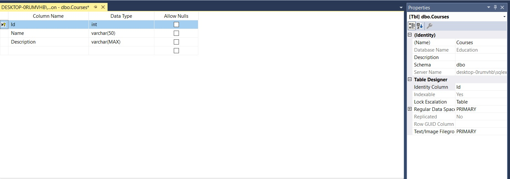 

Ayrıca biz eğer ki bir kaydı silersek onun id'sini asla başka bir kayda vermez. 

Diğer tablolarımızda da aynen bu şekilde Id alanlarını otomatik artan şekilde yapabiliriz. 