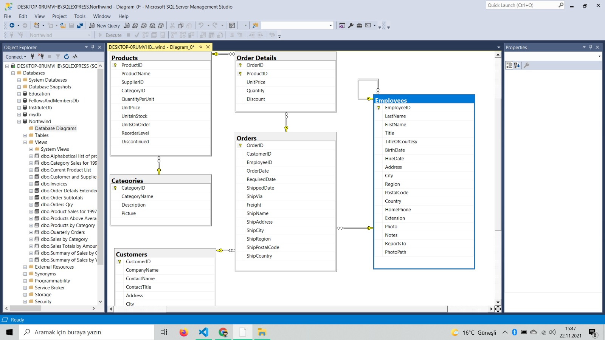
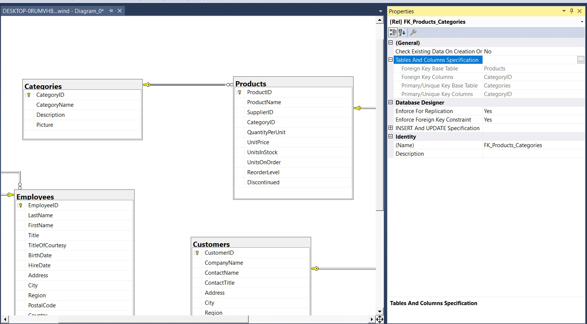

# Mevcut bir Veri Tabanını İnceleme Teknikleri

# Contents
* [Hazır Bir Veri Tabanının Kurulması](#hazır-db-kurulumu)
* [Mevcut Bir Veri Tabanı Nasıl İncelenir?](#mevcut-db-inceleme)

- ## Hazır Bir Veri Tabanının Kurulması 

Biz bir şirkette işe başladığımızda orada halihazırda bir veri tabanı olacak. Dolayısıyla mevcut bir veri tabanını inceleyebilmeyi bilmemiz gerekir. İndirilebilir kaynaklardan dosyayı indirelim. O dosyayı birlikte aç deyip not defteriyle açalım. Açtıktan sonra bütün sayfayı kopyalayalım ve de Sql Server'da new query açıp oraya yapıştıralım. Daha sonra o kodu execute edelim. Böylece database'imiz oluşmuş olacak.

Bu veri tabanı, Northwind isimli, Microsoft tarafından geliştirilmiş hazır ve açık kaynak bir veri tabanıdır. Biz bu veri tabanını bu şekilde kurup içerisindeki tablolar üzerinde işlemler yapabiliriz. Bu yöntem en hızlı ve kolay veri tabanı kurma yöntemidir. 

Bir sonraki süreçte bu veri tabanı içerisindeki tabloları inceleyeceğiz, aralarındaki ilişkileri kurmaya çalışacağız. 

- ## Mevcut Bir Veri Tabanı Nasıl İncelenir? 

Northwind veri tabanını bir e-ticaret veri tabanı şeklinde düşünebiliriz. İçerisinde 16 tane tablo var. Bunlardan bazıları ile ilgili işlemler yapıyor olacağız. 

Database diagram kısmından diagramı açalım. 

Categories, Customers, Employees, Orders, OrderDetails ve Products tablolarını seçelim. 

İlk olarak göz attığımızda bazı tablolar arasında bire çok ilişki olduğunu görürüz. 

İki tablo arasındaki bir ilişkiyi görmek istediğimizde bağlantı oku üzerinde sağ tıklayıp properties deriz. 

Prperties'de Tables and Columns Specification altında tablolar arsındaki ilişkiyi inceleyebiliriz. 

Örneğin kategorilerde içecekler olsun. İçecekler kategorisinin bir çok ürünü olur(Products'ı). O yüzden ana tablo categories'dir. Yani bir kategori - çok ürün / bire çok ilişki. 

Bir diğer örnek. Orders - Order Details tablosu. Bir sipariş olur, o bir siparişin bir çok detayı olur, bire çok ilişki. 

Ayrıca Order Details tablosuna baktığımız da 2 tane anahtar görürüz, bu 2 anahtar 2 tane ayrı Primary key demek değil, bu Unique Key'de verdiğimiz gibi OrderId ve ProductId beraber Primary Key. 

Ayrıca burada ilginç bir durum daha var. Employees tablosu. Bir tablo kendi kendine referans verebiliyor. Genelde böyle bir tasarım, o şirkette hiyerarşik bir durum varsa, kim kime rapor veriyor, kim üstün şeklinde, kullanılır. Burada da EmployeeId'den ReportsTo sütununa bire çok ilişki söz konusu. 